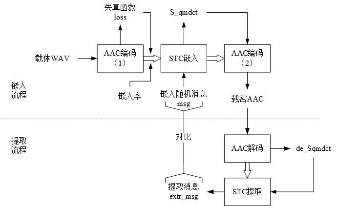

### 任务
1. 概述：音频频域隐写算法实现。
2. 具体地：
	- 在AAC音频里的量化后MDCT（Qmdct）系数上做隐写。保证不可感知。
	- 在Faac编码端嵌入，在Faad解码端提取。
3. 贡献点：根据人耳听觉掩蔽特性，设计失真函数，使用STC隐写框架。
4. 评估：
	- 不可感知性：PEAQ评价标准
	- 抗隐写分析性：集成分类器
5. 局限性：
	- 设计失真的时候，没有考虑统计特性。
	- 所以，抗隐写分析性能欠佳：容易被隐写分析器(二分类器)检测。

### 图解
	- 